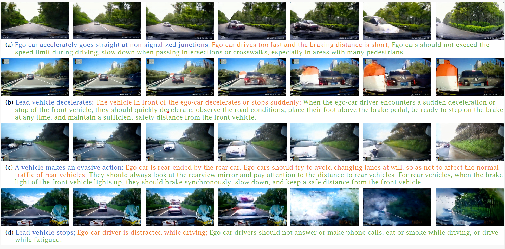
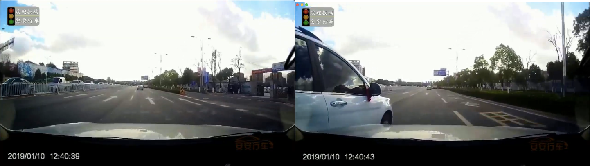
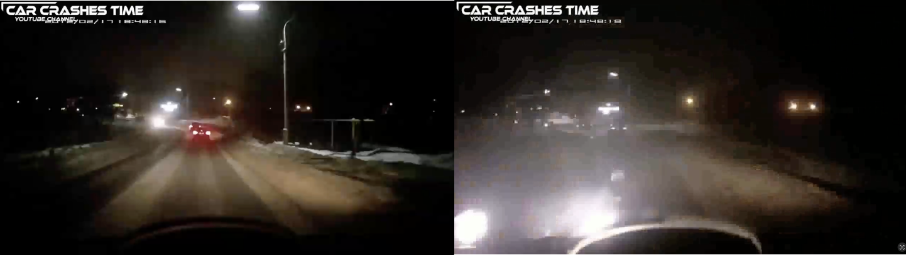

# AVD2: Accident Video Diffusion for Accident Video Description

### The First Work to Generate Accident Videos:

### This repository is an official implementation of AVD2: Accident Video Diffusion for Accident Video Description.
Created by Cheng Li, Keyuan Zhou, Tong Liu, Yu Wang, Mingqiao Zhuang, Huan-ang Gao, Bu Jin and Hao Zhao from Institute for AI Industry Research(AIR), Tsinghua University.

### Our Framework:

### Our Project Video is available at:
[AVD2 Video: https://youtu.be/iGdSIofB_k8](https://youtu.be/iGdSIofB_k8)

# Introduction
We propose a novel framework, AVD2 (Accident Video Diffusion for Accident Video Description), which enhances transparency and explainability in autonomous driving systems by providing detailed natural language narrations and reasoning for accident scenarios. AVD2 jointly tackles both the accident description and prevention tasks, offering actionable insights through a shared video representation.This repository includes (will be released soon) the full implementation of AVD2, along with the training and evaluation setups, the generated accident dataset EMMAU dataset and the conda environment.

# Note
We have uploaded the requirement environment of our AVD2 system.  
We have released the data preprocessing codes ("/root/src/prepro/") and the evaluation codes ("/root/lic/ADAPT-main/src/evalcap/") of the project.  
We have released the part of the preprocessed dataset of the EMMAU dataset ("/root/Processed_Dataset/"). And will released all of them.  
We will soon release the entired code (including the checkpoints file) of the AVD2 system soon.  
We will soon release the dataset of the generated accident video (raw EMMAU dataset).   
We will soon upload the finetuned Open-Sora 1.2 model, which is used for generating the EMMAU Dataset.  
We will soon upload the detailed instructions of the readme document (how to deployment the project).  

# More Details
Our novel AVD2 framework is based on the Action-aware Driving Caption Transformer (ADAPT) and Self Critical Sequence Training (SCST).  
The codes and more information about ADAPT and SCST can be found and referenced here:  
[ADAPT: https://arxiv.org/pdf/2302.00673](https://arxiv.org/pdf/2302.00673)  
[ADAPT codes: https://github.com/jxbbb/ADAPT/tree/main?tab=MIT-1-ov-file](https://github.com/jxbbb/ADAPT/tree/main?tab=MIT-1-ov-file)  
[SCST: https://arxiv.org/abs/1612.00563](https://arxiv.org/abs/1612.00563)  
[SCST codes: https://github.com/ruotianluo/self-critical.pytorch](https://github.com/ruotianluo/self-critical.pytorch)  

# Visualization
## This is the example of the accident frames of our EMMAU dataset:  
  

## This is the visualization of the Understanding ability of our AVD2 system (comparred with the ChatGPT-4o & ground truth):  
### Accident example 1:  
  
**AVD2 Prediction**  
**Description:**
 A vehicle changes lanes with the same direction to ego-car; Vehicles don't give way to normal driving vehicles when turning or changing lanes.  
**Avoidance:**
Before turning or changing lanes, vehicles should turn on the turn signal in advance, observe the surrounding vehicles and control the speed. When driving, vehicles should abide by traffic rules, and give the way for the normal running vehicles. Vehicles that will enter the main road should give way to the vehicles which drive on the main road or leave the main road. Vehicles that drive on the auxiliary road should give way to the vehicles which drive off the main road.

**ChatGPT-4o Prediction**  
**Description:**
 A vehicle approaches a busy intersection and fails to notice another car coming from the side; The vehicle abruptly brakes to avoid a collision, but the close proximity creates a dangerous situation.   
**Avoidance:**
Drivers should always reduce speed when approaching intersections and remain alert to traffic from all directions. Maintaining a safe distance and carefully observing other vehicles is essential to prevent accidents at intersections.

**GroundTruth**  
**Description:**
 Lead vehicle stops; Vehicles do not give way to normal driving vehicles when turning or changing lanes.   
**Avoidance:**
Before turning or changing lanes, vehicles should turn on the turn signal in advance, observe the surrounding vehicles and control the speed. When driving, vehicles should abide by traffic rules, and give the way for the normal running vehicles. Vehicles that will enter the main road should give way to the vehicles which drive on the main road or leave the main road. Vehicles that drive on the auxiliary road should give way to the vehicles which drive off the main road.  

### Accident example 2:  
  
**AVD2 Prediction**  
**Description:**
A vehicle changes lanes with the same direction to ego-car; Vehicles don't give way to normal driving vehicles when turning or changing lanes.    
**Avoidance:**
Ego-cars should not exceed the speed limit during driving, slow down when passing intersections or crosswalks, especially for areas with many pedestrians.

**ChatGPT-4o Prediction**  
**Description:**
 A vehicle makes a sharp turn at an intersection without signaling; The vehicle behind is forced to brake abruptly due to insufficient reaction time.  
**Avoidance:**
Drivers should signal well in advance before making turns at intersections. Maintaining a safe distance from other vehicles and anticipating sudden turns can help prevent accidents.

**GroundTruth**  
**Description:**
Vehicles meet on the road; Vehicles drive too fast with short braking distance.  
**Avoidance:**
Vehicles should not exceed the speed limit during driving, especially in areas with many pedestrians. Vehicles should slow down when passing intersections or crosswalks, and observe the traffic carefully.

# Acknowledgements
We are grateful for the support of the Institute for AIR at Tsinghua University, and Kairui Ding's help on our project, and the LOTVS-MMAU (Multi-Modal Accident video Understanding) team for open-sourcing and sharing the MM-AU dataset.
