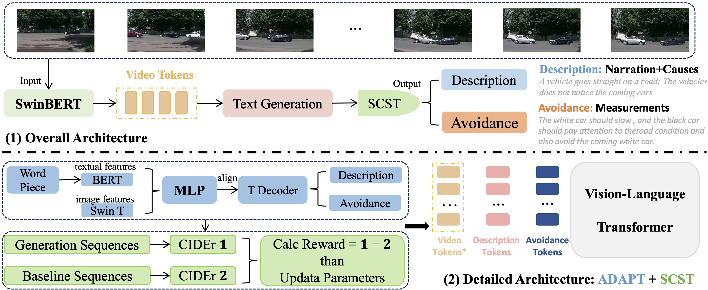

# CATS: Critical Adaptive Transformer for Self-driving Captions

### This repository is an official implementation of CATS: Critical Adaptive Transformer for Self-driving Captions.
Created by Cheng Li, Keyuan Zhou, Tong Liu, Yu Wang, Mingqiao Zhuang, Kairui Ding and Hao Zhao from Institute for AI Industry Research(AIR), Tsinghua University.
### Our Project Video is available at:

# Introduction
We propose a novel framework, CATS (Critical Adaptive Transformer for Self-driving Captions), which enhances transparency and explainability in autonomous driving systems by providing detailed natural language narrations and reasoning for accident scenarios. CATS jointly tackles both the accident description and prevention tasks, offering actionable insights through a shared video representation.This repository includes (will be released soon) the full implementation of CATS, along with the training and evaluation setups, the generated accident dataset EMMAU dataset and the conda environment.

# Note
We have uploaded the requirement environment of our CATS system.  
We have released the data preprocessing codes ("/root/src/prepro/") and the evaluation codes ("/root/lic/ADAPT-main/src/evalcap/") of the project.  
We have released the preprocessed dataset of the EMMAU dataset.  
We will release the entired code (including the checkpoints file) of the CATS system soon.  
We will release the dataset of the generated accident video (EMMAU dataset).  
We will upload the detailed instructions of the readme document.  

# Visualization
This is the example of the accident frames of our EMMAU dataset:  
  
This is the visualization of the Understanding ability of our CATS system (comparred with the ChatGPT-4 & ground truth):  

### Accident example 1:  
**CATS Prediction**
**Description:**
 A vehicle changes lanes with the same direction to ego-car; Vehicles don't give way to normal driving vehicles when turning or changing lanes.  
**Avoidance:**
Before turning or changing lanes, vehicles should turn on the turn signal in advance, observe the surrounding vehicles and control the speed. When driving, vehicles should abide by traffic rules, and give the way for the normal running vehicles. Vehicles that will enter the main road should give way to the vehicles which drive on the main road or leave the main road. Vehicles that drive on the auxiliary road should give way to the vehicles which drive off the main road.

**ChatGPT4 Prediction:**  
**Description:**
 A bus and a sedan collided at an intersection; The sedan ran a red light while the bus was crossing.   
**Avoidance:**
Always obey traffic signals and signs. Increase vigilance when approaching intersections, and ensure the intersection is clear before proceeding, even if the light is green. Drivers should reduce speed and be prepared to stop if necessary to avoid accidents.

**GroundTruth**  
**Description:**
 Lead vehicle stops; Vehicles do not give way to normal driving vehicles when turning or changing lanes.   
**Avoidance:**
Before turning or changing lanes, vehicles should turn on the turn signal in advance, observe the surrounding vehicles and control the speed. When driving, vehicles should abide by traffic rules, and give the way for the normal running vehicles. Vehicles that will enter the main road should give way to the vehicles which drive on the main road or leave the main road. Vehicles that drive on the auxiliary road should give way to the vehicles which drive off the main road.  

### Accident example 2:  
**CATS Prediction**  
**Description:**
A vehicle changes lanes with the same direction to ego-car; Vehicles don't give way to normal driving vehicles when turning or changing lanes.    
**Avoidance:**
Ego-cars should not exceed the speed limit during driving, slow down when passing intersections or crosswalks, especially for areas with many pedestrians.

**ChatGPT4 Prediction:**  
**Description:**
 High-speed highway collision; One car attempted a sudden lane change without signaling, cutting off another.   
**Avoidance:**
Always use turn signals when changing lanes or making turns to alert other drivers of your intentions. Keep a safe distance from other vehicles and check mirrors and blind spots before making any maneuvers. Avoid sudden lane changes, especially at high speeds, and always be aware of the flow of traffic around you.

**GroundTruth**  
**Description:**
Vehicles meet on the road; Vehicles drive too fast with short braking distance.  
**Avoidance:**
Vehicles should not exceed the speed limit during driving, especially in areas with many pedestrians. Vehicles should slow down when passing intersections or crosswalks, and observe the traffic carefully.
